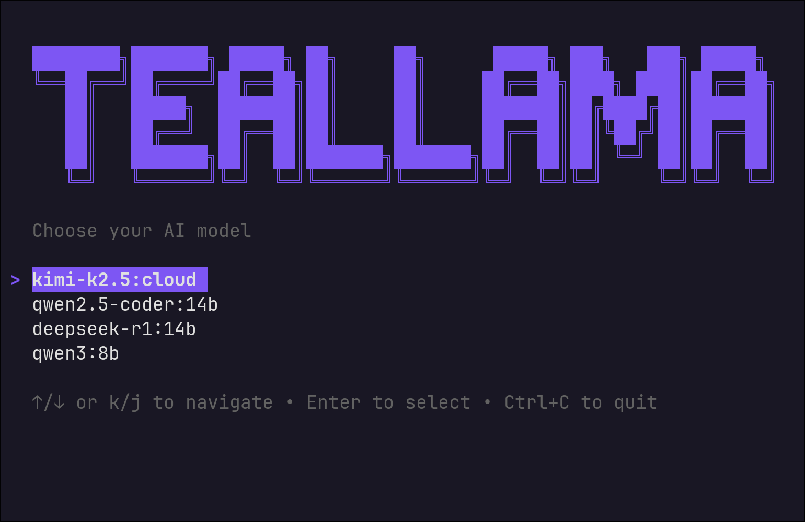
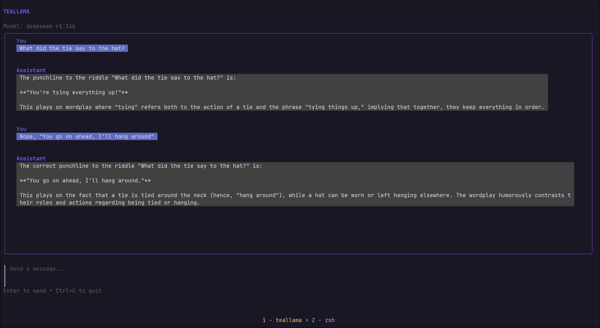

# Teallama 🦙

A sleek, terminal-based UI for Ollama built with Go, [Bubble Tea](https://github.com/charmbracelet/bubbletea), and [Lip Gloss](https://github.com/charmbracelet/lipgloss).


<p align="center">
  
</p>
<p align="center">
  
</p>


## Features

- 🎨 **Beautiful TUI** – Modern chat interface with rounded borders and syntax highlighting
- ⚡ **Real-time Streaming** – Watch responses generate token-by-token
- 📝 **Persistent Context** – Maintains conversation history automatically
- 🎯 **Vim-friendly** – Keyboard-driven navigation (Esc/Ctrl+C to quit)
- 🖥️ **Responsive Layout** – Adapts to any terminal size
- 🔌 **Local & Private** – 100% local inference via Ollama

## Prerequisites

- [Go](https://go.dev/dl/) 1.21 or higher
- [Ollama](https://ollama.ai/download) running locally
- A terminal with truecolor support (Ghostty, Kitty, iTerm2, Windows Terminal)

## Installation

### From Source

```bash
# Clone the repository
git clone https://github.com/yourusername/teallama.git
cd teallama

# Build the binary
go build -o teallama

# Install to system PATH (optional)
sudo cp teallama /usr/local/bin/
